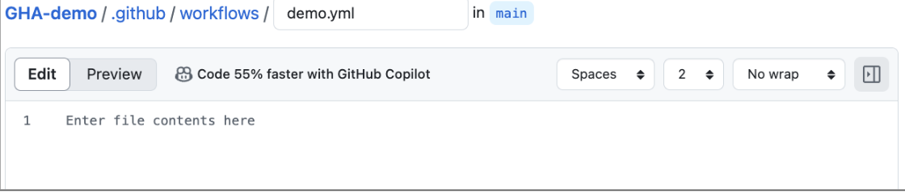
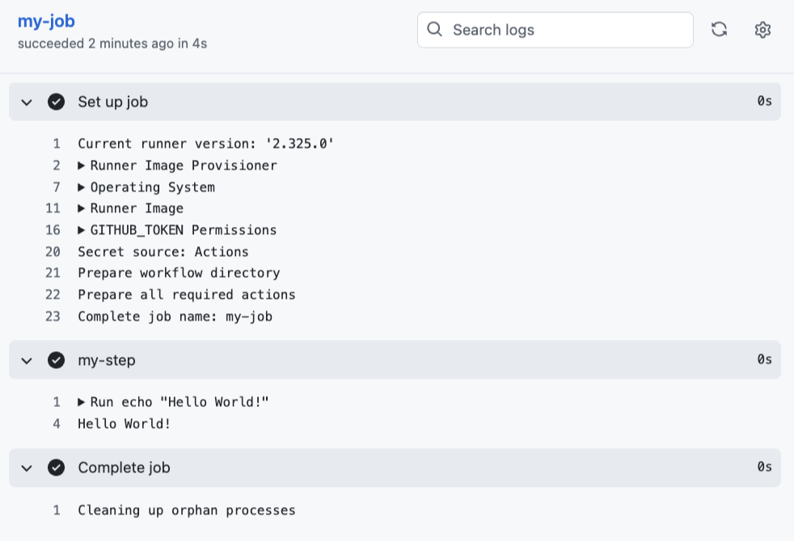

# GitHub Actions: Hello World Workflow

This repository demonstrates how to create and run a basic GitHub Actions workflow.

## Steps Completed

1. **Created Repository**  
   Initialized a new GitHub repository.

2. **Set Up Workflow**  
   - Navigated to the **Actions** tab.  
   - Selected **"Set up a workflow yourself"** to create a new workflow file.  
   - This automatically created a `.github/workflows/` directory.

3. **Created `demo.yml` Workflow File**  
   - Added a `demo.yml` file inside `.github/workflows/`. 
   - Used the following sample workflow from [this gist](https://gist.github.com/weibeld/f136048d0a82aacc063f42e684e3c494) to print "Hello World".

4. **Validated YAML Syntax**  
   - Verified that the YAML was syntactically correct using an online YAML formatter.

5. **Committed and Pushed Changes**  
   - Committed the new workflow file and pushed it to the repository.

6. **Viewed Workflow Run**  
   - Opened the repository main page and clicked the **Actions** tab.  
   - Selected the workflow from the left sidebar.  
   - Reviewed the logs and results of the workflow run:
     - Clicked on the workflow run (named **hello-world**).  
     - Clicked on the job (named **my-job**) to observe the flow and log output. 

## Result

The GitHub Actions workflow successfully executed and printed "Hello World" in the logs.

## Reference
[Video tutorial here.]([https://link-url-here.org](https://www.youtube.com/watch?v=ylEy4eLdhFs&ab_channel=AutomationStepbyStep))
